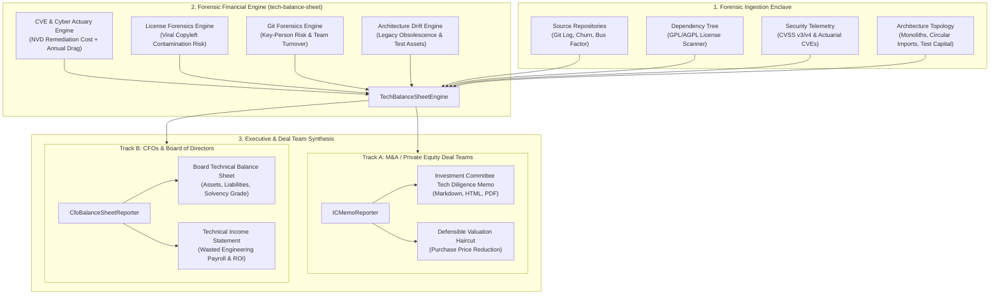
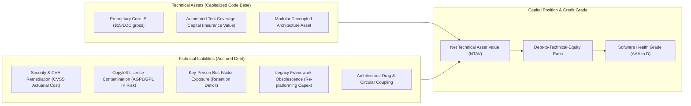
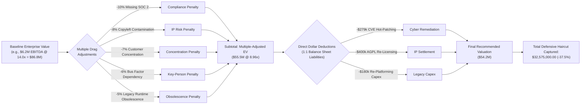
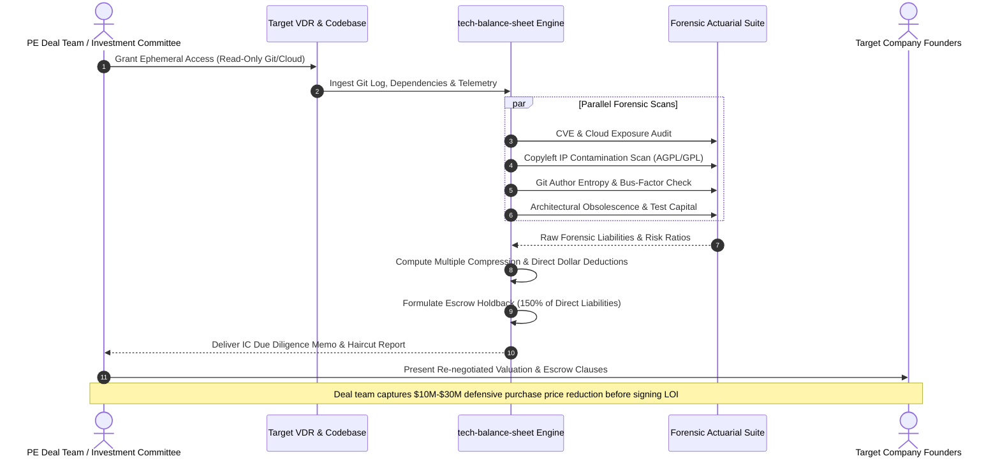
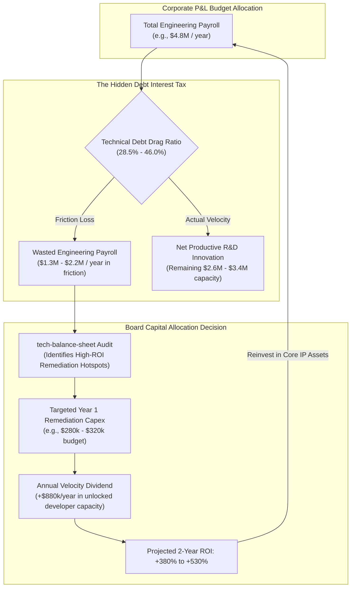

# 🏛️ tech-balance-sheet
> **Autonomous M&A Technical Due Diligence & Board-Level Software Balance Sheet OS**

[](LICENSE)
[]()
[]()
[]()

`tech-balance-sheet` is an enterprise financial-forensic platform that translates source code repositories, software architecture, security vulnerabilities, and team dynamics into **defensible M&A valuation haircuts** for Private Equity deal teams and **GAAP-adjacent Technical Balance Sheets** for corporate Boards and CFOs.

---

## The Strategic Thesis

Every CFO and Board of Directors understands financial debt, depreciation schedules, and capital expenditures. But they have **zero visibility into technical liabilities** until a $20M re-platforming project fails, an outage makes the news, or an acquirer walks away from a deal.

Simultaneously, in software M&A, Private Equity buyout funds pay **$75,000 to $150,000 per deal** to advisory firms (Alvarez & Marsal, West Monroe, Deloitte) for 3-week manual IT due diligence slide decks that lack mathematical leverage during price negotiations.

`tech-balance-sheet` bridges this gap with an algorithmic valuation and balance-sheet engine:
1. **For Buy-Side M&A / Private Equity:** Ingests target data rooms and codebases to output a quantitative **Investment Committee Tech Diligence Memo** with an exact purchase price haircut calculation and escrow holdback clauses within 24 hours.
2. **For Corporate CFOs & Boards:** Generates a quarterly **Technical Balance Sheet and P&L Statement**, translating tech debt interest into wasted engineering payroll and establishing a software credit rating (AAA down to D).

---

## High-Level System Architecture



---

## The Technical Balance Sheet Equation

Just like GAAP financial accounting, the software codebase is modeled as a capital structure:

$$\mathbf{Net\ Technical\ Asset\ Value\ (NTAV)} = \mathbf{Technical\ Assets} - \mathbf{Technical\ Liabilities}$$



---

## M&A Valuation Haircut Waterfall

In buyout transactions, valuation is adjusted systematically across two primary levers: **Multiple Compression** and **Direct Dollar-for-Dollar Deductions**:

$$\text{Final\ Valuation} = \left[\text{EBITDA} \times (\text{Multiple}_{base} + \sum \Delta \text{Multiple})\right] - \sum \text{Direct\ Liabilities}$$



---

## Track 1: Private Equity 24-Hour Diligence Workflow

The following sequence diagram details how the automated diligence engine interfaces with the target's Virtual Data Room (VDR), executes forensic analyzers, and arms the PE Deal Team with an Investment Committee memo before signing the LOI:



---

## Track 3: The Board & CFO Tech Debt P&L Drag Loop

The following architectural model illustrates how technical debt acts as an uncapitalized tax on engineering payroll, and how targeted remediation unlocks a multi-year velocity dividend:



---

### 1. Board Technical Balance Sheet
```text
================================================================================
📊 BOARD OF DIRECTORS: TECHNICAL BALANCE SHEET
================================================================================
ASSETS (Capitalized Software Assets)
* Proprietary Codebase & Domain IP:       $2,470,000.00 (Net Book Value)
* Automated Test Coverage Capital:          $480,000.00 (Net Book Value)
* Modular Architecture Capital:             $225,000.00 (Net Book Value)
TOTAL TECHNICAL ASSETS:                   $3,175,000.00

LIABILITIES (Accrued Technical Debt Obligations)
* Critical CVSS 9.0+ Vulnerabilities:       $75,000.00 ($37,500/yr drag)
* Copyleft License Contamination (AGPL):   $250,000.00 ($35,000/yr drag)
* Extreme Key-Person Dependency:           $120,000.00 ($35,000/yr drag)
* End-of-Life Runtime (Python 2.7):        $180,000.00 ($63,000/yr drag)
TOTAL TECHNICAL LIABILITIES:                $625,000.00

NET TECHNICAL POSITION
* Net Technical Asset Value (NTAV):       $2,550,000.00
* Software Health Rating:                 AA (Solvent, manageable debt)
```

### 2. CFO Technical Income Statement (P&L Drag)
```text
================================================================================
📈 TECHNICAL INCOME STATEMENT (P&L DRAG ANALYSIS)
================================================================================
Total Annual Engineering Payroll:         $4,800,000.00
Technical Debt Drag & Velocity Loss:     ($1,368,000.00) (28.5% drag)
Net Effective R&D Capacity:               $3,432,000.00

Remediation Capital Allocation & ROI Forecast:
* Recommended Year 1 Remediation Capex:     $281,250.00
* Projected Annual Velocity Dividend:       $889,200.00/year unlocked capacity
* Projected 2-Year Remediation ROI:        +532.2%
```

---

## CLI Quickstart

### Running the End-to-End M&A + CFO Demo
```bash
PYTHONPATH=projects python3 -m tech_balance_sheet.cli demo
```

Output:
```text
🚀 Running Autonomous Tech Diligence & Balance Sheet Audit for: CloudFlow Logistics Corp
   Baseline EBITDA: $6,200,000.00 @ 14.0x
   Baseline Enterprise Value: $86,800,000.00

================================================================================
🏛️ PRIVATE EQUITY INVESTMENT COMMITTEE MEMO
================================================================================
Verdict: WALK_AWAY
Baseline Enterprise Value: $86,800,000.00
Adjusted Enterprise Value: $54,225,000.00
Defensive Haircut Captured: $32,575,000.00 (-37.5%)
Recommended Escrow Holdback: $1,990,500.00
Critical Red Flags Identified: 5

================================================================================
📊 BOARD OF DIRECTORS & CFO BALANCE SHEET
================================================================================
Total Technical Assets: $4,016,296.00
Total Technical Liabilities: $1,327,000.00
Net Technical Asset Value: $2,689,296.00
Software Health Credit Grade: A
Annual Wasted Payroll on Tech Debt: $2,208,000.00/yr (46.0%)
Projected 2-Year Remediation ROI: +380.7%

✅ Reports successfully generated:
   - ./output_reports/cfo_technical_balance_sheet.md
   - ./output_reports/ic_due_diligence_memo.md
   - ./output_reports/audit_summary.json
```

---

## Running Test Suite

```bash
PYTHONPATH=projects python3 -m unittest discover -s projects/tech_balance_sheet/tests -v
```

```text
test_cve_actuarial_engine ... ok
test_full_engine_accounting_invariants ... ok
test_git_forensics_bus_factor ... ok
test_license_forensics_copyleft ... ok
test_reporters_render_clean_markdown ... ok

Ran 5 tests in 0.001s (OK)
```

---

## License
Apache-2.0
